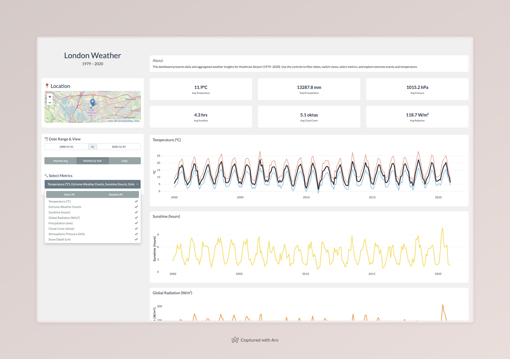

# 🌤️ London Weather Dashboard

This Shiny app displays weather data collected at Heathrow Airport in London from 1979 to 2020. Users can view and compare daily readings or monthly averages for several variables, including temperature, precipitation, sunshine, cloud cover, pressure, radiation, and snow depth.

## 🖼️ Interface Preview



## ⚙️ Setup and Installation

To run the app:

- Install R (version 4.0 or later).
- Install required packages: shiny, shinythemes, shinyWidgets, ggplot2, dplyr, readr, leaflet, scales, plotly.
- Clone this repository.

In RStudio or an R console, run ``` shiny::runApp(".") ```

The dashboard will open in your browser.
